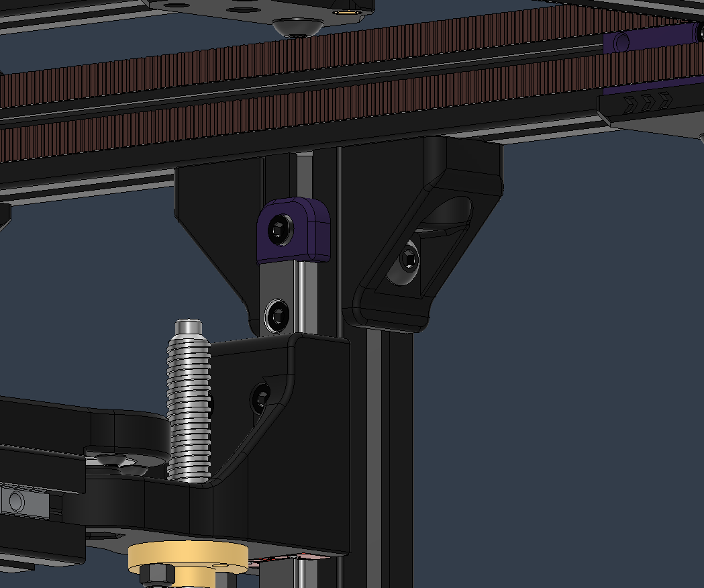

# Voron Trident Rear Gantry Brace for 2020 Extrusion

On Trident when no rear protrusion is desired, the extrusion at the rear of the gantry should mate with the vertical brace.
Stock Trident brackets have this part offset, but on Monolith, these parts sit flush. You can use these printed alternative parts, or Misumi angled brackets work just as well.

## BOM

Same as stock Trident.

- M5x10 BHCS - 4 pcs
- M5 Roll-In T-Nut - 4 pcs

